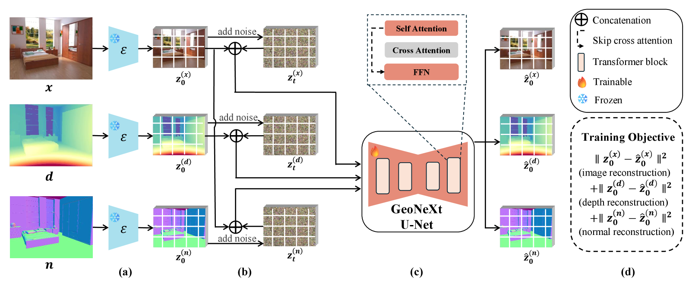

# GeoNeXt

## Video Generative Models as Geometry Learner

[Homepage](https://happy-hsy.github.io/projects/GeoNeXt/) · [Paper](https://arxiv.org/pdf/2608.28549) · [Models](https://huggingface.co/happy0612/GeoNeXt)

> **Video Generative Models as Geometry Learner**  
> Haosen Yang, Jifei Song, Zhensong Zhang, Xiatian Zhu\*, Jiankang Deng\*  
> **ECCV 2026**

This repository is the official implementation of **"Video Generative Models as Geometry Learner"**.

## Demo

https://github.com/user-attachments/assets/dbd11870-e23e-4522-a5d1-1500c0f0261a

## Updates

- `2026/08/31`: Inference code released.

## Framework

<p align="center">
  
</p>

## Requirements

- Linux
- Python ≥ 3.10
- CUDA GPU with 24 GB VRAM (sufficient for inference)

> **Note:** GeoNeXt-Wan and GeoNeXt-SVD should be installed in separate environments.

### GeoNeXt-SVD

```bash
conda create -n geonext_svd python=3.10 -y
conda activate geonext_svd

git clone https://github.com/Creative-Intelligence-Studio/GeoNeXt.git
cd GeoNeXt
python -m pip install torch==2.3.1 torchvision==0.18.1 \
  --index-url https://download.pytorch.org/whl/cu121
python -m pip install -r requirements-svd.txt
python -m pip install -e .
```

### GeoNeXt-Wan

GeoNeXt includes the tested DiffSynth inference implementation under
`diffsynth/`; no separate DiffSynth checkout is required.

```bash
conda create -n geonext_wan python=3.10 -y
conda activate geonext_wan

git clone https://github.com/Creative-Intelligence-Studio/GeoNeXt.git
cd GeoNeXt
python -m pip install torch==2.3.1 torchvision==0.18.1 \
  --index-url https://download.pytorch.org/whl/cu121
python -m pip install -r requirements-wan.txt
python -m pip install -e .
```

The tested Wan dependency stack uses Diffusers 0.28.0, Transformers 4.40.1,
PEFT 0.7.0, and Accelerate 0.29.3. Avoid upgrading these packages independently.

## 🤗 Pretrained Models

Our pretrained models are available on the Hugging Face Hub:

| Version | Hugging Face Model | Depth | Normal | #Params |
|---|---|:---:|:---:|---:|
| GeoNeXt-Wan | [happy0612/GeoNeXt-Wan](https://huggingface.co/happy0612/GeoNeXt/tree/main/GeoNeXt-Wan) | ✅ | ✅ | 1.42B |
| GeoNeXt-SVD | [happy0612/GeoNeXt-SVD](https://huggingface.co/happy0612/GeoNeXt/tree/main/GeoNeXt-SVD) | ✅ | ✅ | 1.52B |

The selected GeoNeXt checkpoint, base model, and VAE are downloaded
automatically on the first inference run and then reused from the Hugging Face
cache.

To download both GeoNeXt checkpoints manually instead:

```bash
hf download happy0612/GeoNeXt --local-dir checkpoints
```

Local model paths can still be supplied with `--checkpoint`, `--base-model`,
and `--vae-model` for offline use.

## Inference

The `--input` argument accepts either one image or a directory. Supported image
formats are JPEG, PNG, WebP, and BMP.

### GeoNeXt-Wan

```bash
conda activate geonext_wan

python inference.py \
  --input assets/input \
  --output outputs/wan \
  --steps 5
```

### GeoNeXt-SVD

```bash
conda activate geonext_svd

python inference.py \
  --backend svd \
  --input assets/input \
  --output outputs/svd \
  --steps 5
```

Run `python inference.py --help` for all shared options.
Mesh export is optional and is enabled only when `--export mesh` is provided.
Exported meshes use MoGe alignment by default. Use `--align-space relative`
explicitly to export a mesh without MoGe.

## Outputs

Both backends write the same directory structure:

```text
outputs/<backend>/
├── depth_raw/         # Normalized disparity in [0, 1] (.npy)
├── depth_vis/         # Colorized depth maps (.png)
├── normal_raw/        # Surface normals in [-1, 1] (.npy)
├── normal_vis/        # RGB normal visualizations (.png)
└── geometry/<image>/  # Optional depth, intrinsics, and mesh files
```

## Metric-scale alignment

Mesh export uses metric-space MoGe alignment by default. Activate the
corresponding backend environment and install the pinned MoGe-2 integration
once:

```bash
./scripts/setup_moge.sh third_party/MoGe
```

The setup script reuses the active environment's tested PyTorch installation
and does not modify its PyTorch, CUDA, Transformers, Diffusers, or NCCL packages.
Then export an aligned mesh with:

```bash
python inference.py \
  --backend wan \
  --input assets/input/case1.jpg \
  --output outputs/wan-moge \
  --export mesh
```

To export relative geometry without installing MoGe, add
`--align-space relative`.

## Web viewer

After exporting a mesh, start the viewer with:

```bash
python -m http.server 8000
```

Open `http://localhost:8000/viewer/` and select the exported `.ply` file.

## Citation

If GeoNeXt contributes to your work, please cite our paper:

```bibtex
@article{geonext2026,
  title   = {Video Generative Models as Geometry Learner},
  author  = {Yang, Haosen and Song, Jifei and Zhang, Zhensong and Zhu, Xiatian and Deng, Jiankang},
  journal = {arXiv preprint arXiv:2608.28549},
  year    = {2026}
}
```

## Acknowledgements

This release builds on Wan, Stable Video Diffusion, Hugging Face Diffusers,
DiffSynth, MoGe, and Trimesh. Please also follow the licenses and citation
requirements of those projects. See [NOTICE.md](NOTICE.md) for third-party
notices.
